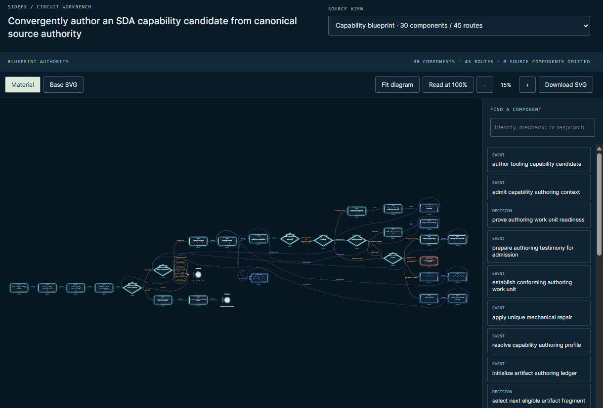
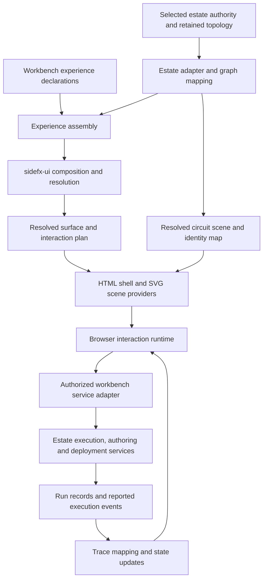

# Circuit workbench architecture plan

Date: 10 September 2026  
Status: architecture and delivery plan, grounded in the inspected implementation. The first hosted invocation increment is recorded in [hosted-workbench-delivery.md](hosted-workbench-delivery.md); authoring, composition and estate-derived service deployment remain subsequent work.

## 1. Direction

Build `sfx-circuit-workbench` as the primary interface for understanding, creating, composing, invoking and operating the capability estate. Keep the circuit visible as the user moves between those activities. Selection, inputs, results, authoring findings, execution testimony and deployment status should refer to the same identifiable capability and circuit revision.

Recreate the current workbench first using the architecture in `C:\lab\sidefx-ui`. Preserve its dark technical appearance, source views, complete diagrams, inspection tools and interaction behavior. Establish the separation between semantic declarations, resolved geometry, interaction plans and target providers during that recreation. Subsequent UI changes should mostly alter declarations or providers while preserving domain contracts, source identities and execution behavior.

The product grows through five connected activities:

| Activity | Intended experience |
| --- | --- |
| Create | Describe or speak an intent; inspect the authoring conveyor, candidate artifacts, findings and evidence; establish a usable capability through the appropriate lifecycle. |
| Invoke | Find an existing capability, enter only the inputs the user owns, run it through the authorized estate/API path, and inspect its actual outcome. |
| Observe | Watch reported execution progress on the circuit while it runs, then inspect and replay the retained evidence. |
| Compose | Create contract-compatible workflows and integrated circuits using existing capabilities and explicitly bound integrations. |
| Deploy | Derive a bounded service from selected estate authority, build and verify it, deploy it, and follow its operational evidence back to its circuit. |

Hugging Face remains a required deployment destination for the interactive product. Local development is useful for implementation and checks; a local demonstration does not complete the hosted invocation milestone. The existing private SideFX Space and remote invocation service provide the starting delivery path.

## 2. What exists today

### The supplied workbench

The screenshot establishes the visual reference: title and source selector above an authority/coverage strip, then Material/Base SVG and navigation/export controls, with the circuit occupying most of the body and a searchable component outline on the right. It shows the authoring capability blueprint with **30 components, 45 routes and zero omitted source components**, fitted to **15%** at the captured viewport of **1220 × 827**.



The supplied image is retained with this document. The initial implementation now also retains complete source-backed graph fixtures and interaction baselines; see the delivery record for verification scope.

The pasted iframe HTML shows a different selected view: **“Execution · Admit the capability authoring context,” 10 components, 9 routes and 25% zoom**. Its selected elements and trace classes are captured interaction state. These are two baseline fixtures, not conflicting definitions of one graph. Browser-added attributes and transient trace tokens are capture artifacts, not UI authority.

The source viewer also includes controls below the screenshot: illustrative trace playback, next/reset, speed and follow controls, outgoing routes, selected-entity detail, contracts/facts, source digest and pointer, and findings. Preserve that complete experience.

The current authoring sources are in [content-creation-mission/templates/estate-topology](../../repos/content-creation-mission/templates/estate-topology/index.html), with [topology compilation](../../repos/content-creation-mission/scripts/compile_estate_topology.py) and [Graphviz/SCL rendering](../../repos/content-creation-mission/scripts/estate_topology_render.py). The website serves restored products under [sfx-platform/public/media/library/templates/estate-topology](../../repos/sfx-platform/public/media/library/templates/estate-topology/index.html). The normalized source views, graph geometry, SVG, materials, catalog and lineage are reusable inputs. The captured DOM is a reference for appearance and behavior.

The existing [viewer.js](../../repos/content-creation-mission/templates/estate-topology/viewer.js) couples graph loading, state, DOM updates, camera behavior, selection and playback in one page. Its `planTrace` constructs a finite illustration covering declared edges, including alternatives; it is not observing branch decisions or provider execution. That distinction must survive the migration.

### The reusable UI foundation

The [sidefx-ui law](../../sidefx-ui/sidefx-compose-ui-surface/docs/sidefx-ui-law.md) separates geometry from interaction and target realization:

| Existing responsibility | Workbench application |
| --- | --- |
| `establish-ui-surface` | Root dimensions, coordinate space, overflow and interaction profile for the workbench. |
| `establish-ui-container` | Header, toolbar, diagram viewport, outline, inspector and later contextual panels. |
| `resolve-ui-layout` | Resolve stack/grid/free declarations into regions; own shell geometry independently of rendering. |
| `establish-ui-component` | Establish semantic controls and content independently of where they reside. |
| `establish-ui-state` | Establish selected view, search, presentation mode, inputs and other logical interaction state. |
| `bind-ui-state` | Bind value or validation aspects to specific components and physical mutation targets. |
| `validate-ui-state` | Establish admissibility and messages from declared constraints. Invalid user input is a disposition; malformed authoring declarations produce findings. |
| `dispatch-ui-action` | Determine each action's admissibility and name its scenario event. |
| `compose-ui-surface` | Sequence constituent capabilities, own recursive composition and attribute findings. |
| `project-ui-surface` | Project the resolved tree through a target provider; HTML is the useful initial target. |
| `realize-html-interaction` | Lower bindings, validation mechanics and action facts into a browser interaction plan. |

The four geometry primitives remain four. Circuit meaning belongs in a workbench graph contract and a specialized provider; it does not become a fifth geometry primitive. The composition resolves constituents through their declarations and records implementation and semantic digests. Primitives should continue to avoid importing one another.

The browser runtime consumes lowered instructions rather than interpreting capability contracts or taxonomy rules. Its action boundary is especially useful: the current [runtime](../../sidefx-ui/sidefx-html-interaction/runtime/sidefx-ui-runtime.js) can report `DISPATCHED` while explicitly reporting execution `NOT_ATTEMPTED` and an unavailable `execute-scenario-event` provider. Real business execution requires a separate adapter.

### Evidence and limits

The retained [design-canvas Chromium receipt](../../sidefx-ui/sidefx-project-ui-surface/out/design-canvas.chromium.conformance.receipt.json) reports 21 observed regions/tenants, zero divergence and maximum geometry delta 0 px, against a 0.5 px tolerance. The retained [interaction parity receipt](../../sidefx-ui/sidefx-html-interaction/out/mortgage-application.interactive.parity.receipt.json) covers Chromium, Firefox and WebKit. These are existing specimen results dated 31 August, not new workbench verification.

The following gaps are material to this plan:

| Finding in the inspected foundation | Consequence |
| --- | --- |
| Workspaces describe themselves as unmanaged, provisional computational material without governed capability authority. | Reuse their code and evidence with explicit version pins. Do not represent reuse as managed estate admission. |
| [Composition declaration](../../sidefx-ui/sidefx-compose-ui-surface/capability.json) still names constituent locations such as `C:/lab/sidefx-ui-surface`; the inspected folders are under `C:/lab/sidefx-ui/`. | Make dependency resolution relocatable before a repeatable build; retain digest recording. |
| Some early READMEs say binding/validation/action are not built, although their implementations now exist. | Use declarations, current code and receipts to establish support; reconcile stale documentation during implementation. |
| Stack/grid/free layout exists; intrinsic content measurement and automatic sizing are not established. | Start with explicit dimensions and viewport profiles. Declare a measurement provider only when a concrete layout requires one. |
| The design-canvas specimen declares `pan-zoom`; this is not proof of physical graph gestures or camera execution. | Implement and verify the graph viewport interaction provider. |
| The existing component taxonomy does not establish an interactive circuit scene. | Add an explicit graph component/provider contract and support checks. |
| Choice reflection is documented as incomplete; dynamic lists, graph replacement and asynchronous server-state updates are not established by the mortgage specimen. | Verify and extend these before claiming full workbench parity. |
| State is per-page; durable drafts, undo/redo, sessions and run persistence are not provided. | Assign those responsibilities to explicit workbench/domain services and protocols. |
| Business event execution and typed composite parsing remain gaps. | Connect the command boundary; add parsers only for required controls. |
| WPF is a shelved structural projection experiment. | Keep another target possible through contracts; do not promise working desktop parity. |

The [capability gap inventory](../../sidefx-ui/sidefx-compose-ui-surface/docs/capability-gap-inventory.md) is a useful boundary record. This plan does not turn every gap into prerequisite work.

### The hosted execution foundation

The [deployed private Lab](../../repos/sfx-platform/docs/live-finance-deployment.md) already records successful Hugging Face runs for Hello World, personal greeting, retained provider examples and live stock retrieval. Its path is Space → authenticated Azure service → selected database authority and declared provider-input binding → RapidAPI → native normalization. This evidence is dated 9 September local time / 10 September UTC; reverify the selected deployment during implementation.

Reuse its [input ownership and invocation contracts](../../repos/sfx-platform/docs/private-lab.md), server assembly, exact authority checks and refusal behavior. The live finance root remains a normalizer; the separately declared provider-input binding obtains the native testimony. HTTP evidence and kernel outcome remain separate.

The retained [CLI result](../../repos/sfx-embody/evidence/hugging-face-live-finance/cli-result.json) contains execution identities and observations with scenario, step, sequence, status and time. It contains one execution and five observations for that run. This is a seed for mapping evidence to topology, not proof of an event stream or observation of every displayed mechanic. The deployed pilot is synchronous and has no durable asynchronous run-status service.

## 3. Target architecture



There are three separately versioned kinds of data:

1. **Domain authority and evidence:** capability contracts, topology, workflow definitions, selected authority identities, provider bindings, observations and deployment records.
2. **Experience declarations:** which domain information and user actions a mode presents; input ownership; surface/container/layout/component/state/binding/action declarations; renderer requirements.
3. **Resolved products:** region trees, circuit geometry, physical interaction plans and projection receipts. These are derived from the first two and carry their pins.

An authoring description can propose changes to the first two. It cannot make a browser-projected value authoritative merely by displaying it.

### Ownership boundaries

| Owner | Responsibility |
| --- | --- |
| `sidefx-ui` | General UI semantics, composition, geometry, bindings, validation lowering, target projection and generic physical interaction mechanics. |
| `sfx-circuit-workbench` | Workbench experiences, circuit scene contract, graph/source adapters, command and trace integration, view models and workbench evidence. |
| `content-creation-mission` | Existing source-topology compiler, SCL graph rendering and material products, reused through a versioned adapter initially. |
| `sfx-platform` / Hugging Face host | Application hosting, authenticated session boundary, deployment packaging and embedding integration. |
| Database delivery / `sfx-embody` and SDK | Select and verify executable authority; execute through the existing kernel/provider boundary; report execution testimony. |
| Authoring and deployment services | Candidate lifecycle, durable workflow execution, builds, release policy, infrastructure operations and audit records. |

Keep the existing Python UI implementations as compiler dependencies initially. Package a pinned dependency closure and call it through a narrow build/service interface; do not rewrite their rules in TypeScript merely to fit the existing web host. Compile geometry when the experience, graph or viewport profile changes. Process ordinary input and trace updates through the resolved interaction plan, without spawning a composition process per animation frame.

The initial physical targets are HTML for the shell and SVG for the circuit. A React/Next host can mount the result and provide the server adapter, but should not also own the resolved subtree's state and DOM mutations. Choose one mutation owner for each region. Do not create a separate page framework for each capability.

### Circuit scene and layout

Retain the current graph renderer's node boxes, route paths, SCL shapes, labels and materials as the first scene input. Generic shell layout determines the graph viewport rectangle. The scene provider owns graph-space geometry, hit targets and the camera transform inside that rectangle. Graphviz performs graph layout; `resolve-ui-layout` does not infer graph topology from relationships.

Introduce an explicitly supported semantic circuit component with a versioned scene payload. The provider receives resolved geometry and source references, not executable HTML supplied by a user. It supports node/route selection, keyboard interaction, material/base presentation, zoom/scroll, export and an independently updated trace overlay. Missing required interaction support must produce a visible unsupported result instead of silently reducing the graph to an image.

For the first migration, a verified legacy SVG can be consumed as a scene artifact while the shell and behavior are rebuilt through the new boundaries. Preserve digests and approved asset references; reject scripts, event handlers and unapproved external references during ingestion. Replace global `window.ESTATE_TOPOLOGY_*` transport and executable catalog loading with schema-checked data. Keep graph loading race protection so an older response cannot replace the newly selected graph.

A future SVG, Canvas or WebGL provider must preserve the scene contract, source mapping, accessible inspection model and selection commands. Change renderer only after representative large-graph measurements justify it. Virtualizing painting must not remove nodes from coverage counts, search, export or the underlying graph.

### Semantic identity and provenance

Maintain separate identities for the source capability/scenario/operation, graph view, node/route, UI component, layout residency and runtime execution occurrence. The current `n-…` DOM identifiers are projection identifiers, not substitutes for source authority.

A graph mapping record needs the selected snapshot/projection and source digests, view kind, source identity and pointer, graph entity ID, and the native scenario/step or lowering lineage when that relationship is established. Support many-to-many mappings and explicit unmapped evidence. Repeated calls and loop iterations need their own execution occurrence identities even when they highlight the same source node.

Preserve blueprint, operations, native execution and expression views as different views of their respective source material. Switching views should retain the selected semantic subject where a mapping exists and report when it does not. Do not synthesize a runnable sequence by flattening these views together.

### Where optionality lives

| Requested change | Primary change point | Invariant |
| --- | --- | --- |
| Color, material, typography or density | Presentation profile; re-resolve geometry if metrics change | Source identity and business behavior |
| Move the inspector or add a contextual panel | Surface/container/layout declarations | Component/state/action identities |
| Change graph layout or renderer | Scene layout/projection provider | Graph meaning, coverage and evidence mapping |
| Add another capability or outcome presentation | Published contract/interaction metadata and a supported presentation family | Server admission and input ownership |
| Add voice input | Intent capture adapter and candidate-review state | Existing authoring and execution boundaries |
| Embed on the website or open in the Space | Host adapter and packaged projection | Experience definitions and domain services |
| Add a backend, integration or deployment target | Explicit service/provider adapter | UI action contract and authorization requirements |

Prove this separation with a second layout profile that relocates the inspector and changes the theme while preserving action and source identity receipts. A collection of JSON files is not sufficient proof if component-specific branches still control behavior in the runtime.

## 4. Recreate the current experience

The initial profile is `source-inspection`: the current two-column body, not the future palette/canvas/runner arrangement. Additional modes can activate new regions after parity is established.

| Current element or behavior | Declaration/provider responsibility | Parity criterion |
| --- | --- | --- |
| Workbench title and source view selector | Heading, choice, selected-view state and catalog binding | Same title, grouped view choices and visible selected option; selection loads the correct graph. |
| Authority and coverage strip | Read-only values from source view | Exact node/route/omission counts and view kind; missing evidence is shown. |
| Material / Base SVG | Shared presentation state and two actions | Pressed state is reflected; material visibility changes without altering graph identity. |
| Fit / 100% / zoom controls | Camera state and scene interaction provider | Existing fit, reading scale, ± behavior and visible zoom; camera changes do not relayout authority. |
| Scrollable drawing | Viewport container and scene provider | Same clipping, graph centering, scroll behavior, selection and keyboard activation. |
| Searchable component outline | Search state, filtered collection and selection action | Search identity/label/detail; selection inspects and brings the component into view. |
| Outgoing routes and inspector | Selected-entity state, collections and text/value components | Same route navigation, detail, facts, contracts, source digest/pointer and findings. |
| Illustrative trace controls | Explicit illustrative playback state and provider | Play/pause, next, reset, speed and follow preserve finite declared-route behavior. |
| Download SVG | Export action over the verified base scene | Complete vector export, with material images removed as the current exporter does; no execution claims. |
| Embedded height reporting | Host adapter | Stable height updates with the existing bounded frame checks. |

Extract the current colors and typography into a named presentation profile: shell `#0a1b28`, circuit background `#071722`, principal text `#dfebed`, and the existing technical labels, borders and selection treatment. Preserve the initial 245 px outline column and 630 px drawing region from the stylesheet where the selected viewport profile allows them. Reproduce the screenshot's fitted state explicitly; the current loader can choose a reading zoom for a large graph, so the screenshot zoom is not a universal load default.

Keep shell decoration from changing resolved geometry. The existing projection work already demonstrates the border/padding problem: a decorative border or a second application of padding can move children away from their resolved boxes. Use geometry-neutral decoration or include the dimensions in the resolver's inputs. Font changes that affect measurement require new geometry evidence.

Declare responsive arrangements as viewport profiles with explicit recomposition. Preserve selection, input and run identity across recomposition. Keep an accessible outline and route list as alternative ways to navigate the diagram, keyboard focus restoration after updates, text output escaping, and reduced-motion playback. The graph must remain useful without following an animated camera.

## 5. State, contracts and command execution

The names below describe proposed contracts and modules; they are not claims that these schemas already exist in `sidefx-ui`.

| Proposed contract | Essential content |
| --- | --- |
| `workbench-experience.v1` | Mode, supported view kinds, declaration references, required provider features, UI dependency pins and publication reference. |
| `capability-ux.v1` | Input/outcome contract pins, input ownership, semantic field and result presentations, diagram anchors, dialog composition, supported outcome variants and transition intents. |
| `circuit-scene.v1` | Source/view identities, complete nodes and routes, resolved geometry, material references, semantic hit targets, mapping references, coverage and findings. |
| `workbench-command.v1` | Action and request identities, subject, permitted editable values/example selection, publication pin, expected draft/run revision where applicable. |
| `workbench-state-update.v1` | Session/run/graph scope, monotonic revision, authorized producer, explicit changed state values and invalidation information. |
| `execution-event.v1` | Durable event and run identity, sequence, parent/occurrence identity, source mapping, event kind, status, timestamps and evidence references. |
| `service-release.v1` | Exposed contract, permitted capability closure, authority/runtime pins, secret references, deployment policy, artifact and verification evidence. |

### State ownership

Keep transient view state (search, selection, material mode, camera, open inspector sections) separate from saved authoring/workflow drafts and reported runtime state. Invocation input belongs to a particular publication and input revision. Execution observations are read-only testimony; a user can change their presentation but cannot edit their meaning.

The current fixed/mutable state model needs an explicit extension for updates from an authorized service. A value may be read-only to the user while changing as execution proceeds. Define allowed producers and update scope; route updates through bindings. Do not bypass the state model with ad hoc DOM writes for streamed results. Reject late updates for a replaced graph, obsolete input revision or different run.

Each physical target has one binding owner. Updating a value must not replace a wrapper's `textContent` when that wrapper also owns nested controls or detail content. Dynamic outlines need keyed collection updates and focus preservation. Camera state remains a small provider-owned physical operation referenced by the plan, not a business-domain interpreter.

Persist user preferences separately from versioned drafts. Draft undo/redo records domain edits; undo does not reverse an external effect. Run records and evidence need service-side durability before reload, reconnect or multi-user operation can be supported honestly.

### Inputs and action admissibility

Retain the Lab's established ownership:

| Interaction | User-owned input | System assembly and presentation |
| --- | --- | --- |
| Hello World | Explicit Run | Exact contract and empty payload; greeting text. |
| Personal greeting | Required name, 1–100 Unicode code points | Fixed contract and declared payload child; output escaped as text. |
| Provider demonstration | One of four retained examples, then Run | Complete canonical fixture remains server-owned; show disposition, counts, reasons, findings and digests. |
| Live finance | Allowed symbol and region | Declared request and credential binding; actual provider response passed to the normalizer; price, currency, market/retrieval times and attribution. |

Contracts remain the source for admissible values; fixtures remain the source for examples and expected outcomes. Interaction profiles express presentation and ownership bound to schema digests. They do not replace registered authority or grant permission by themselves.

Compile the required UI constraints into the `sidefx-ui` interaction plan. Reuse the Lab's schema/resource resolution, server assembly, policy and tests; migrate its browser field checks into the lowering path instead of adding another schema interpreter to the new runtime. Server validation remains independent and authoritative.

Per-action admissibility lets an invalid draft be saved or cancelled while Run remains unavailable. Recheck the resolved action disposition even if a browser control's disabled attribute is bypassed. This is useful UI behavior, but the service must still authenticate, authorize and validate every submitted command.

### Connect the execution port

The new service adapter connects an admissible action to the existing SDK command path, currently `POST /commands` with capability invoke selection and a canonical input assembled by the server. A browser request must not gain arbitrary subject, namespace, endpoint, fixed-field or fixture-inventory control.

The adapter resolves the published subject, validates editable values, constructs the admitted input, checks authority pins, invokes the existing delivery and maps the outcome back to state. Surface stale publication, unavailable provider, refused input, domain failure and uncertain delivery distinctly. Changing input invalidates the old displayed result. Direct database-selected invocation already exists; this workbench must not add an unnecessary preparation prerequisite.

Keep SQL, RapidAPI and infrastructure credentials in the appropriate remote service. Hugging Face retains only its scoped server-side service configuration. The growing estate-management interface also needs authenticated user identity and per-operation authorization for author, invoke, inspect sensitive evidence, publish and deploy. A shared Space-to-service credential cannot establish every user's authority to perform those operations.

The existing iframe is sandboxed with `allow-scripts allow-downloads`; [CircuitFrame](../../repos/sfx-platform/components/estate/circuit-frame.tsx) accepts height messages only from that frame's window, with opaque origin `null` and bounded numeric heights. Preserve that read-only embedding boundary initially. Run the interactive application with its authenticated server adapter in the Space. A later command-capable embed requires its own schema-checked, session-bound message protocol and authorization path; the height channel's wildcard sending and `null` origin do not authenticate commands.

For durable effects, add service-side request identity and deduplication before exposing retries or resumable execution. Disabling Run is not duplicate-execution protection. The existing synchronous pilot deliberately preserves uncertainty and makes no automatic retry; retain that behavior until durable request/run reconciliation exists.

## 6. Contract-driven input and outcome dialogs

The complete interaction should feel like opening and operating the circuit itself. A user selects an input component in the diagram; an **“Enter Capability Input”** dialog expands from that component, containing controls generated from the capability's input contract and declared UX. On **Submit**, the authorized invocation is admitted, the dialog shrinks back into its source component, and the live circuit displays execution. When a validated outcome arrives, an outcome dialog expands from the corresponding outcome component, using components generated from the outcome contract and declarative outcome UX.

This is a required product flow for M2/M3. M2 establishes generated dialogs and real hosted invocation; M3 connects the same flow to authentic intermediate execution events. A separate form page or a generic JSON result panel does not complete this experience.

### Contracts supply shape; UX declarations supply presentation

Use a proposed `capability-ux.v1` declaration alongside the existing capability contracts and interaction profiles. Pin it to the selected input schema, permitted outcome schemas, publication and capability revision. Extend the current ownership/profile compiler rather than creating a second source of validation rules.

| Source | What it determines |
| --- | --- |
| Input contract and resolved schema resources | Data shape, types, required properties, admissible values and supported variants. |
| Input ownership declaration | Which values a user may edit, which come from a selected fixture, and which the service fixes, derives or binds. A schema property alone does not grant edit permission. |
| Input UX declaration | Labels, help, grouping, order, supported control preferences, conditional presentation and dialog composition. |
| Outcome contract and selected variant | The meaning and valid shape of the actual returned outcome, including domain dispositions. |
| Outcome UX declaration | Component families, data-pointer bindings, labels, units, collections, visual hierarchy and evidence presentation for each supported variant. |
| Workbench presentation/interaction profile | Shared styling, spacing, accessible behavior, dialog geometry and expansion/collapse motion. |
| Source-to-scene mapping | The input and outcome anchors for the selected capability instance and execution occurrence. |

The declaration can choose among compatible presentations; it cannot widen a contract, invent a successful outcome or make a system-owned field editable. A published UX profile must be checked against every referenced schema pointer and provider feature. Unknown references, ambiguous variants and unsupported required controls produce compilation findings before the experience is offered for execution.

### Generate input controls

The compiler resolves the scoped schema resources and combines them with explicit ownership and presentation metadata. It then emits `sidefx-ui` state definitions, semantic components, bindings, lowered validation instructions, container/layout declarations and Submit/Cancel actions. Component and state identities derive from the capability instance, contract identity and field pointer, so rearranging the dialog preserves the draft and field errors.

| Contract shape and declared meaning | Generated input presentation |
| --- | --- |
| Editable string | Text input; declared multiline content can select a text area. Preserve contract length/pattern behavior and declared whitespace handling. |
| Enumeration or explicit alternatives | Choice control with declared labels and stable values; reflect the currently selected value. |
| Boolean | Checkbox or toggle according to the UX declaration. Preserve absence when the field is optional; do not silently equate it with `false`. |
| Integer or number | Numeric control with contract bounds and a declared parsing policy; empty input remains distinct from zero. |
| Object | Declared field group whose children bind to their own pointers; assemble the object from admitted children. |
| Array | Repeating group or collection editor with stable item identities, item validation and contract cardinality limits. |
| Optional or nullable field | Explicit omission/null behavior appropriate to its contract and UX; do not coerce every empty control into an empty string. |
| Discriminated variant | A declared variant selector and compatible field groups; retain draft values separately and submit only the chosen admissible shape. |
| Date/time, money, file or other composite value | A registered semantic component with a supported parser/binding protocol; a string or object shape alone is insufficient to infer one. |
| Fixed, derived or system-bound value | Service assembly, optionally accompanied by permitted read-only context; no editable control. |

Implement this mapping as a versioned component registry and compilation rules. An entry declares accepted schema/semantic shapes, required UX properties, parsers, bindings and provider support. New custom controls become reusable registered components. They are not arbitrary JavaScript or HTML embedded in a capability profile. Unsupported input shapes stay explicitly unsupported until their component and parser are established.

Generate conservative standard controls for supported primitive shapes when ownership is explicit and richer UX metadata is absent. Require explicit metadata where shape does not establish meaning. Schema defaults may initialize a declared draft only under the input policy; they are not proof that a user supplied a value. Conditional visibility must not bypass required-field validation. Resolve references from pinned resources, without fetching arbitrary schema URLs in the browser.

Opening the dialog selects the admitted input interface for the capability instance. An internal mechanic or an input port already supplied by a workflow can open inspection without becoming an independently invocable entry point. In workflow mode, display upstream-bound values as read-only and collect only the inputs the workflow exposes to the user.

### Generate outcome components

The service validates the returned outcome against the permitted contract/variant and retains its run, occurrence and authority identity. The UX compiler's corresponding presentation plan binds actual outcome values to read-only semantic state and components. The browser receives resolved bindings and supported component instructions, not a new contract interpreter.

| Declared outcome presentation | Generated components and required metadata |
| --- | --- |
| Greeting or explanation | Escaped text, heading or callout bound to declared pointers. |
| Scalar result or financial quote | Value/metric components with explicit amount, currency/unit, precision policy, label and timestamp bindings. |
| Domain disposition | Status component whose labels and visual treatment follow the declared disposition mapping; provider success and business success stay separate. |
| Structured record | Grouped read-only fields with declared order, labels and optional-value behavior. |
| Repeated records | Table or cards with declared item path, columns/fields, row identity and empty-state presentation. |
| Time series or other analytical result | A registered chart component with explicit series, axis, unit and missing-data mappings. Do not infer a chart merely because an array is present. |
| Artifact, image or downloadable result | A registered artifact/media component with typed, authorized resource references and availability state. |
| Findings and execution evidence | Findings list, expandable detail, timestamps, digests and links to authorized evidence for this run. |

Compose custom outcome dialogs from these registered components using declaration data. For live finance, declare a prominent price with currency, symbol, market time, retrieval time and attribution, followed by provider/normalization evidence. For provider selection, declare disposition and considered/eligible counts above provider reasons and findings. The renderer chooses supported components and bindings from the plan without branching on capability names.

Match outcome variants by validated contract identity and discriminator, not by guessing from available fields. Declare useful layouts for negative domain outcomes as well as success. A delivery refusal or unknown execution state uses the workbench's delivery-status presentation; it is not fabricated capability output. An invalid or unsupported returned shape produces a visible contract/presentation finding and only authorized diagnostic detail, never a plausible-looking success card. Missing, null and zero values remain distinct.

An intermediate workflow outcome can update its node and become inspectable while the overall run continues. Auto-open the primary outcome dialog when the active invocation reaches its declared terminal outcome. Other runs and intermediate branches receive a visible result indicator rather than repeatedly stealing focus. Retain every result for reopening from its node and run history.

### One compilation path for both dialogs

```text
Selected capability + input/outcome contracts + pinned schema resources
              + capability UX + input ownership + scene mapping
                                   |
                         Resolve and check compatibility
                                   |
                  Compile semantic controls, state and actions
                                   |
                Compose sidefx-ui regions and lower interaction
                                   |
            Input dialog plan       Outcome plans by contract/variant
                       \             /
                   Shared HTML/dialog component providers
```

The UX declaration needs, at minimum, an input anchor, dialog title, field/group references, explicit Submit/Cancel intents, outcome-anchor mappings, outcome layouts and transition intents. For example, a personal-greeting profile binds its name field to `/payload/name` in `personal-greeting-request.v1` and its text outcome to `/payload/message` in `personal-greeting.v1`. It can group, label and animate those components without changing either contract. The existing [pilot profiles](../../repos/sfx-embody/docs/research/hugging-face-platform/pilot-interaction-profiles.json) supply these ownership and pointer bindings; anchors, modal composition, richer component selection and motion are proposed extensions.

Compile and pin the reusable plans when publishing the experience. Instantiate them with the selected capability instance, authorized draft, current viewport and returned data at runtime. A layout change may trigger geometry recomposition; opening an existing dialog or receiving another outcome does not require an LLM to generate a new interface. Give authoring tools the same UX schema so they can propose valid, reviewable UX declarations alongside capability contracts.

### Interaction lifecycle and diagram motion

| Transition | Required behavior |
| --- | --- |
| Input selected → dialog open | Resolve the interface and its current graph anchor; expand the generated dialog with the title “Enter Capability Input,” capability context and field controls. Focus the first suitable control. |
| Editing → invalid submission | Keep the dialog open, preserve the draft, show field-linked findings and focus the first invalid input. No execution is submitted. |
| Valid Submit → admission pending | Send only admitted editable values/example selection through the existing server assembly path. Preserve the draft and prevent duplicate submission while the response is unresolved. |
| Admission pending → accepted | Associate the accepted request with its run identity; shrink the dialog toward the input node and show that run on the circuit. |
| Accepted → executing | Apply actual execution events to the mapped circuit. Buffer display updates during the transition if needed, while retaining all events. |
| Executing → validated terminal outcome | Mark the mapped outcome occurrence and expand its generated outcome dialog, bound to the exact result and run. |
| Outcome dismissed → circuit | Collapse toward the outcome node, restore focus and keep a result indicator so the same outcome can be reopened. Dismissal does not erase evidence. |

This lifecycle requires an early run-acceptance response containing the request/run identity and pinned selection, followed by run-status lookup. Persist the deduplicated request-to-run association before initiating external effects. Add that minimal durable admission/status protocol in M2; M3 extends it with retained intermediate events and streaming. The existing synchronous `/commands` completion response alone cannot acknowledge a run early enough for this handoff. Keep using its validated execution boundary behind the new protocol.

Runtime execution follows server admission and may begin before the shrinking animation finishes. The animation never schedules execution, manufactures progress or blocks evidence collection. A very fast run may already have its outcome; sequence the visual transitions without adding fake execution time or losing the result. If admission is refused, keep the draft and show the refusal. If delivery becomes uncertain, retain a recoverable pending/unknown view and reconcile the request rather than automatically submitting again. Cancelling the input dialog before Submit performs no invocation; cancelling a running capability is a separate acknowledged service action.

Declare motion as intents such as `expand-from-anchor` and `collapse-to-anchor`, with duration/easing supplied by the shared presentation profile. The scene provider resolves graph coordinates through the current camera into viewport coordinates; the dialog provider owns overlay placement, clipping avoidance and animation. Use the same typography, component styling and visual tokens as the capability experience. Recompute the visual anchor after zoom, pan or resize; if the source node is unavailable, use a labeled viewport transition while retaining its semantic identity.

Add a reusable modal/overlay provider with focus containment, accessible title/description, keyboard dismissal where applicable, focus return and reduced-motion transitions. Animate the visual shell without changing field identity or writing domain state through animation callbacks. These facilities, richer controls and asynchronous outcome bindings need explicit provider support and receipts; the existing canvas and mortgage specimens do not establish the complete interaction.

### End-to-end acceptance

From the private Hugging Face workbench, open a capability's input node using mouse and keyboard; verify the generated controls against its contract and ownership, Submit, observe the dialog collapse and authentic live events, then inspect the automatically generated outcome dialog from the mapped outcome node. Exercise greeting text, retained provider outcomes and the live finance quote using the same compiler and runtime.

Verify input errors, unsupported component findings, stale schema/profile pins, variant selection, duplicate Submit, immediate completion, refused/uncertain delivery, negative domain outcomes, stream reconnection and reopening a retained result. Repeat with reduced motion, a changed viewport and a second layout profile. The input and outcome dialogs must retain the same contract, field, run and source identities throughout. This is the acceptance boundary for the complete generated UX.

## 7. Live execution in the circuit

Make trace mode explicit throughout the interface and exported evidence:

| Mode | Source and behavior |
| --- | --- |
| Illustrative | Declared topology. Preserve today's finite route illustration, including alternatives. It creates no execution evidence. |
| Observed replay | Retained observations from an identified execution. Playback uses reported occurrences and timestamps; missing detail remains missing. |
| Live execution | Events published as the remote execution progresses, tied to a durable run and pinned circuit mapping. Show stream freshness and disconnected state. |

Live execution requires new backend work. Instrument the execution and provider boundaries to publish observations as they happen, persist them, and expose an authorized stream and run snapshot. Returning observations only after `/commands` completes can support replay; animating that response cannot satisfy the live milestone.

Extend the existing observation identities where possible. Each persisted event needs a durable event ID, run ID, sequence within that run, parent execution/occurrence identity, reported status and times, and evidence/source references. Record an attempt or iteration when the same step can execute repeatedly. A sequence orders ingestion; it does not imply parallel branches were causally sequential. Retain parent/causal relationships separately.

Map native scenario/step observations through the pinned source-to-execution mapping. Highlight only the node or scope the instrumentation can establish. If an event identifies an operation but not its expression mechanics, show the operation as active and mark mechanic-level detail unavailable. Do not light every internal dependency or predict which branch will run. Unknown mappings appear in an unplaced-evidence panel with their identities and findings.

The live finance path is the first substantive proof. Show provider-request progress at the instrumented provider-binding boundary and normalization progress at the native scenario boundary. HTTP 200 establishes a transport result, not a valid quote or successful domain outcome. Preserve each outcome, response digest, retrieval time and reported failure independently.

### Delivery and failure behavior

Start with a same-origin event endpoint behind the authenticated workbench server, using server-sent events for downstream progress and ordinary commands for user actions. SSE supplies event IDs and reconnection behavior, including `Last-Event-ID`; durable retention and replay must be implemented by the service. This transport choice follows the [HTML server-sent events specification](https://html.spec.whatwg.org/multipage/server-sent-events.html), not a claim that the current service supports it.

Use the authenticated server session for browser access and a scoped server credential upstream. Avoid credentials in event URLs. Verify that the actual Hugging Face and upstream hosting path delivers events without buffering until completion. If streaming is unavailable, use cursor-based polling over the same durable log and label delivery accurately; that still requires observations to be published during execution.

The runtime should:

- Deduplicate events and resume from a persisted cursor; detect missing ranges and reconcile with a run snapshot.
- Keep concurrent runs isolated and refuse to apply an event to a different graph revision.
- Distinguish connection loss from run failure. A disconnected browser does not establish that execution stopped.
- Distinguish “cancellation requested” from acknowledged cancellation and report effects that may already have occurred.
- Batch visual updates without dropping the durable event history. Allow pausing the camera/display while collection continues.
- Retain explicit terminal testimony; elapsed time, a closed connection or a finished animation cannot establish completion.

The live acceptance test must observe at least one authentic intermediate event in the hosted workbench **before** the remote run completes. Retain server/browser timing evidence, then exercise reconnect, duplicate events, a missing range, parallel occurrences and a provider failure. Use a controlled instrumented test capability for long-running/reconnect cases when a stock request completes too quickly; do not manufacture progress for the finance call.

## 8. Authoring and integrated workflows

### Estate navigation and lifecycle

Keep a shared estate catalog behind every mode: search by capability identity and meaning, inspect available revisions and contracts, follow dependencies and provider bindings, and see relevant execution, assurance and deployment evidence. Opening an item should select its circuit and contextual actions without creating an unrelated administrative screen. Treat draft, published, executable, unavailable and retired states distinctly; displaying a catalog entry does not establish that it can run in the selected environment.

Version changes, registration, access changes and retirement are service commands with revision checks and recorded outcomes. Show affected workflows and deployments before applying a lifecycle change. Preserve previously executed revisions for evidence inspection. This navigation and lifecycle model lets the workbench grow from individual diagrams into an estate management surface while retaining the circuit as its central view.

### Voice-to-value and description-driven creation

Add an authoring mode around the same circuit and inspector. Text and voice produce a reviewable intent record with transcript/description, requested outcome, constraints, proposed contracts and integration needs. Voice capture is an input adapter; the resulting intent enters the same authoring conveyor.

Connect the authoring service to the existing capability-authoring blueprint shown in the reference workbench. Present the selected work unit, model invocation, testimony admission, repair decision, assembled artifacts and closure evidence at the granularity the service reports. The authoring graph is an excellent demonstration of observing the system author its own capabilities, provided the trace remains tied to actual authoring executions.

Expose draft/candidate, validated, executable/provisioned, registered and managed-admission states according to the lifecycle actually used. Token provisioning and managed admission are different paths; the interface should present their applicable requirements without inventing a universal promotion step. Model-produced artifacts remain proposals until their validation and relevant authority transition establish otherwise.

A bounded authoring session needs artifact revisions, schema/provenance pins, findings, repair limits, model/credential references, and authorized resource budgets. Resume through durable work-unit identity. Render generated text and proposed artifacts as data; model output does not supply browser scripts, SQL commands or deployment instructions for the UI to execute independently.

### Circuit composition

Add palette and wiring tools as a separate `compose` experience profile, reusing the source inspector and scene provider. The saved object is a versioned domain workflow with capability instances, port/contract bindings, declared control flow and explicit execution policy. Node positions belong to presentation metadata. Moving a node cannot change its contract identity or execution order.

A proposed connection must resolve the actual source/target contracts and either prove compatibility or identify the required transformation capability. Reject unresolved ports, stale capability revisions, illegal cycles, incomplete joins and unbound providers before execution. Draft editing remains possible while findings exist. Saving, validating and running are separate commands.

The workflow service owns fan-out/join semantics, bounded loops, schedules, retries, timeouts, cancellation, compensation and durable recovery. These cannot be supplied by the scene's illustrative playback algorithm. Support optimistic revision checks for concurrent draft edits and an undo history over draft changes; retain an immutable executed revision for every run.

| Intended circuit | Additional contract/service needs |
| --- | --- |
| Login flow | Established identity-provider/session integration, redirect/state binding and server-side credential handling; display authorization outcomes without exposing tokens. |
| Digital employee / automated tasks | Durable triggers, schedules, queue/worker ownership, scoped delegation, budgets and intervention points; execution continues independently of an open browser. |
| RPA | An explicit remote/device executor, permitted application actions, executor identity and interruption/effect evidence. The workbench is the controller and observer. |
| Multiple RapidAPI integrations | Per-provider request/response bindings, secret references, rate limits, source attribution and independently observable failures; transformations are declared capabilities. |
| CNCF technologies | Discovery metadata leading to an explicit connector or deployment adapter with compatibility and execution evidence. A listing alone supplies no executable binding. |

The [CNCF Landscape repository](https://github.com/cncf/landscape) provides categorized project/product data and points to the software that generates its site. Use it as discovery input with retained source/version and attribution. Establish the specific integration contract and adapter separately before making a discovered item runnable. Ingest only metadata approved for reuse, rather than copying an entire generated third-party dataset.

## 9. Secure microservices from the estate

Introduce a `deploy` experience over a selected capability or workflow revision. A release declaration identifies the external API contract, permitted capability closure, selected authority identities, provider bindings, runtime and artifact pins, secret references, and target environment. The workbench submits release commands to a deployment service and displays its evidence.

The service pipeline should:

1. Validate the selected capability closure, input/output contracts, exposure policy and required bindings. Record unresolved dependencies as findings.
2. Derive a bounded HTTP/service adapter and package the exact execution closure using a pinned runtime/base image. Produce a reproducible manifest, dependency inventory and artifact digest.
3. Verify contract behavior, negative authorization cases, secret handling and resource/network limits. Retain build and verification evidence attached to the release.
4. Deploy to an isolated target, verify health and authenticated invocation, and change traffic only under the selected environment's release policy.
5. Register the service endpoint, deployed artifact, authority pins, health and trace linkage. Retain the prior release for rollback and record the traffic transition.

Enforce authentication and capability/tenant authorization at service entry, least-privilege workload identity, bounded input and execution resources, and allowed provider/network destinations. Resolve secrets in the target environment. Exposing one capability must not expose unrestricted estate invocation or arbitrary endpoint execution through a generic service route.

Reuse the current remote Lab's scoped invocation, exact pins and image-based packaging as an implementation starting point. Do not claim that it already supplies a release controller, per-user estate administration or arbitrary microservice generation. Build logs, release state and runtime observations should appear against the same circuit, with distinct identities for the authoring run, build, deployment and service invocation.

## 10. Proposed workspace shape

Only this documentation is being created now. The following is the implementation boundary to establish:

```text
sfx-circuit-workbench/
  docs/                         Architecture, decisions, acceptance records
  contracts/                    Experience, capability UX, scene, command, update, event and release schemas
  experiences/
    source-inspection/          Initial parity declarations
    invoke/                     Contract-generated input and outcome dialog experiences
    author/                     Intent and authoring conveyor experience
    compose/                    Workflow editing experience
    deploy/                     Release and operational experience
  profiles/                     Layout/viewport and visual presentation profiles
  adapters/
    estate/                     Catalog, source, contracts and identity mapping
    topology/                   Existing compiler/scene product ingestion
    invocation/                 Existing SDK/service boundary
    trace/                      Native/provider observations to trace state
    authoring/                  Candidate and work-unit service protocol
    deployment/                 Build/release service protocol
  providers/
    circuit-svg/                Scene projection, camera, hit targets and export
    html/                       Required HTML, modal and declarative component extensions
  runtime/                      Plan integration and authorized state updates
  host/                         Space/website mounting and server adapter
  fixtures/                     Pinned graphs, interaction scripts and sanitized observations
  tests/                        Contract, parity, refusal and hosted acceptance checks
  evidence/                     Manifests and durable verification summaries
```

Generic fixes belong in `sidefx-ui` and should be consumed through a pinned dependency manifest. Keep workbench-specific topology and estate semantics here. Keep generated projections/builds separate from authored declarations and exclude credentials and sensitive raw runtime payloads from distributable fixtures.

Publish one versioned workbench package for both the website and the private Space. Pin the experience, UI implementation, provider, graph and publication revisions in the package manifest. An estate update must create a new derived product and invalidate incompatible inputs/mappings, rather than silently changing the graph beneath an active run.

## 11. Delivery sequence and completion gates

Each milestone leaves a usable increment. All five product activities remain in scope; visual parity is the first gate, not the final product.

| Milestone | Concrete work | Exit evidence |
| --- | --- | --- |
| **M0 — Freeze the reference and make composition portable** | Retain the two captured views with their source/catalog/SVG/material inputs and digests. Record control behavior and source counts. Resolve the moved UI workspace paths through a pinned, relocatable dependency manifest. | Clean dependency resolution; existing specimen receipts reproduced against the packaged closure; a baseline manifest identifies exactly what is being recreated. |
| **M1 — Recreate the full source workbench** | Declare the existing shell, state, bindings and actions. Integrate the verified SVG scene. Implement required choice/collection/camera/update support. Replace legacy page handlers with plan-driven behavior. | Both reference views match visually and functionally, including below-fold inspection and illustrative playback. No source components/routes lost; alternate layout/theme retains identities. Hosted inspection package works in the private Space and the website embed. |
| **M2 — Invoke real capabilities from the circuit** | Compile input/outcome contracts and capability UX into node-anchored dialogs; connect their Submit and result bindings to the authorized remote command adapter, with durable run acceptance and status lookup. | Hello, personal greeting, all four provider examples and live finance execute from generated dialogs in the Hugging Face workbench. Dialog collapse/expansion preserves draft, source and result identity. Live finance evidence shows actual provider response and database-selected normalization. Refusals and uncertain outcomes remain accurate. |
| **M3 — Observe execution live** | Extend the run store with retained events, runtime/provider instrumentation, source mapping, authenticated delivery and reconnect reconciliation; connect terminal outcome events to the generated outcome dialog. | The full input dialog → Submit/collapse → authentic live circuit flow → generated outcome dialog works in the hosted workbench. Intermediate events appear before completion. Retained evidence proves mapping, reconnect, concurrent occurrences and failure behavior. Completion-only replay does not pass. |
| **M4 — Author and compose capabilities** | Add text/voice intent capture, authoring service integration, candidate findings/revision views, contract-aware wiring and durable workflow execution. | A described capability passes its applicable validation/lifecycle and runs remotely. A circuit containing multiple real capability instances validates and runs with a trace. Scheduled/RPA/provider adapters qualify individually. |
| **M5 — Build and deploy bounded services** | Add release declaration, reproducible packaging, verification, target deployment, traffic transition and rollback integration. | A selected estate revision becomes an authenticated service; authorized and denied requests are verified; deployment and invocation evidence link back to the circuit; rollback is demonstrated. |

M0 → M1 → M2 is the immediate implementation path. M3 is required for the promised live circuit experience and should shape event/mapping contracts during M1. Authoring and workflow execution use that durable run model; deployment builds on versioned executable selections and policy. Start with the existing runtime and hosted destination, and expand providers only against concrete use cases.

### Acceptance details

**Visual and interaction parity:** retain the 1220 × 827 screenshot case and the distinct native-view DOM case, plus fitted and 100% states. Compare screenshot output, semantic geometry, selection, outline filtering, route navigation, material switching, export and all playback controls. Use the foundation's 0.5 px geometry tolerance for resolved region checks and record actual deltas; evaluate font/material raster differences separately. Run the meaningful browser interaction suite in Chromium, Firefox and WebKit. Verify narrower declared viewport profiles, keyboard navigation, escaping and reduced motion.

**Source fidelity:** verify node/route identity sets and counts against pinned source products, source digest/pointer retention, and no silently omitted topology. Include an expression view, parallel paths, alternatives, recurrence, a disconnected component and a large graph. A graph can be fully represented while only partially observable; report both facts separately.

**Architecture:** fail unresolved required providers, duplicate binding targets, schema/digest mismatches and unknown graph mappings explicitly. Prove that a layout/theme change leaves semantic identity and action receipts intact. The new workbench must not depend on the old `viewer.js` to supply its state or behavior after M1; retaining its SVG output is a separate, valid migration choice.

**Hosted invocation:** use the private [BPMSoftwareSolutions/SideFX Space](https://huggingface.co/spaces/BPMSoftwareSolutions/SideFX) and remote service with no loopback dependency. Verify fixed-field forgery, unauthorized capability selection, stale publication, provider unavailability and invalid output. A live price is compared to its own retained provider testimony; a previous run's price is not an expected constant. Keep returned text escaped and expose only the evidence the user is authorized to inspect.

**Operations:** record graph size and load/interaction measurements before selecting a performance budget or another renderer. Exercise reload, stream interruption and expired access against durable run truth. Show unavailable/unknown states instead of optimistic success. Verify deployment authorization and rollback at M5, without treating a build completing as proof that a healthy service is serving traffic.

### First implementation work package

Create the baseline manifest and two fixtures, establish relocatable UI dependencies, define the minimal scene contract, and author the source-inspection surface. Complete visible choice reflection, keyed outline updates and camera/selection bindings before expanding modes. Produce the resolved tree, projection receipt, interaction plan and browser parity evidence. Then mount the same package in the Space and website, and proceed directly to the already-working remote finance integration.

The older [website design specification](../../repos/sfx-platform/docs/website-design-spec.md) remains useful for circuit composition concepts and evidence distinctions. Its future palette layout does not replace the supplied visual baseline, and its earlier preparation/session-only execution assumptions must yield to the deployed direct-invocation path and the durable live-run architecture proposed here.

## 12. Source record

The plan is based on local code, declarations and retained evidence inspected on 10 September 2026. No fresh application test, capability invocation, UI migration or deployment was performed to create this document.

| Source | Used for |
| --- | --- |
| User-supplied screenshot and iframe HTML | Exact visual reference and captured interaction state; their view selections differ. |
| [UI law](../../sidefx-ui/sidefx-compose-ui-surface/docs/sidefx-ui-law.md), [composition](../../sidefx-ui/sidefx-compose-ui-surface/compose_ui_surface.py), [declaration](../../sidefx-ui/sidefx-compose-ui-surface/capability.json) | Geometry vocabulary, interaction separation, constituent resolution, findings and relocation gap. |
| [Component semantics](../../sidefx-ui/sidefx-ui-component/semantics/component-semantics.v1.json), [state](../../sidefx-ui/sidefx-ui-state/README.md), [HTML interaction](../../sidefx-ui/sidefx-html-interaction/README.md) | Semantic vocabulary, state ownership, physical runtime and current limitations. |
| [HTML projection](../../sidefx-ui/sidefx-project-ui-surface/README.md), [design-canvas authority](../../sidefx-ui/sidefx-compose-ui-surface/surfaces/design-canvas.surface.json) | Provider geometry discipline and the existing canvas specimen. |
| [Viewer template](../../repos/content-creation-mission/templates/estate-topology/index.html), [CSS](../../repos/content-creation-mission/templates/estate-topology/viewer.css), [runtime](../../repos/content-creation-mission/templates/estate-topology/viewer.js) | Complete current control surface, layout, export and illustrative trace behavior. |
| [Topology compiler](../../repos/content-creation-mission/scripts/compile_estate_topology.py), [renderer](../../repos/content-creation-mission/scripts/estate_topology_render.py) | Source lineage, complete view generation, graph geometry and materials. |
| [Website frame](../../repos/sfx-platform/components/estate/circuit-frame.tsx), [design specification](../../repos/sfx-platform/docs/website-design-spec.md) | Embedding boundary and existing composition direction. |
| [Hugging Face platform plan](../../repos/sfx-embody/docs/hugging-face-platform-plan.md), [pilot profiles](../../repos/sfx-embody/docs/research/hugging-face-platform/pilot-interaction-profiles.json) | Capability-led experience and proposed input/presentation metadata. |
| [Private Lab](../../repos/sfx-platform/docs/private-lab.md), [deployed finance](../../repos/sfx-platform/docs/live-finance-deployment.md), [verification summary](../../repos/sfx-platform/docs/huggingface-verification.json) | Existing hosted implementation, ownership policy, invocation evidence and synchronous limits. |

The HTML standard and CNCF primary sources are linked at their respective decisions above. All newly named contracts, providers, modes and milestones in this document are proposed implementation work unless explicitly identified as existing.
